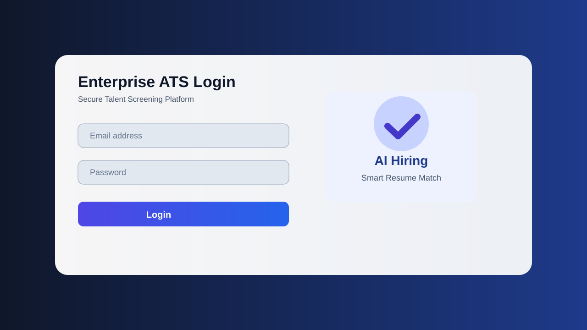
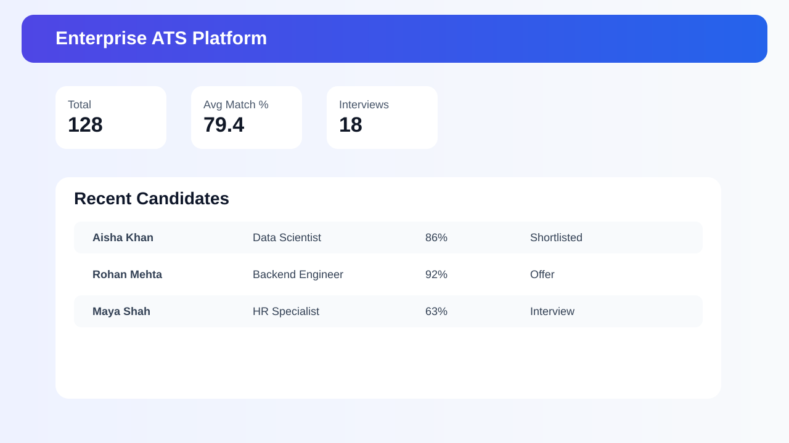
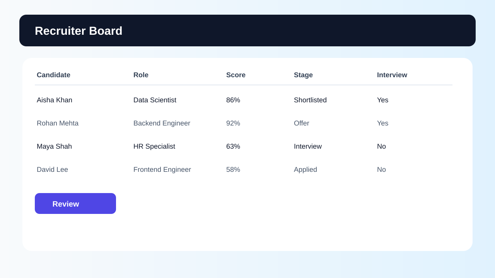
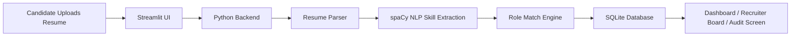

# AI Resume Screening & ATS Dashboard

<p align="center">
  
  
  
  
  
</p>

<p align="center">
  
</p>

## Overview

This project is an AI-powered Applicant Tracking System (ATS) built with Python and Streamlit. It helps recruiters screen resumes, score candidates against job requirements, and manage applicants through a lightweight hiring pipeline.

The system combines resume parsing, skill extraction, SQL-based data storage, and a recruiter-friendly dashboard to simulate a practical hiring workflow.

## Why this project?

Recruitment teams often deal with large volumes of resumes, making manual screening slow and inconsistent. This ATS prototype demonstrates how NLP and structured data pipelines can:

- extract candidate skills from resumes
- match them against target job roles
- identify candidates with strong fit
- track applicants through hiring stages
- support compliance and audit visibility

## Key Features

- Role-based login for Admin, HR, Recruiter, and Client
- Resume upload support for PDF and DOCX
- NLP-based skill extraction using spaCy
- Match score calculation against selected role requirements
- Candidate tracking through stages: Applied → Shortlisted → Interview → Offer
- Lightweight SQLite database for persistence
- Compliance and bias-risk review view
- Shortlist export workflow

## Screenshots

### Login Screen

<p align="center">
  
</p>

### Dashboard & Insights

<p align="center">
  
</p>

### Recruiter Board

<p align="center">
  
</p>

## Architecture



## Tech Stack

| Layer | Technology |
| --- | --- |
| Frontend | Streamlit |
| Backend | Python |
| NLP | spaCy |
| Data Storage | SQLite |
| Resume Parsing | PyPDF2, python-docx |
| Deployment | Local / Docker-ready |

## Project Structure

```text
AI_Resume_Screening_DS/
├── app.py                 # Main Streamlit application
├── backend.py            # FastAPI resume parsing utility
├── ats.db                # SQLite database
���── requirements.txt      # Python dependencies
├── docs/
│   └── screenshots/
│       ├── login-screen.svg
│       ├── dashboard.svg
│       └── recruiter-board.svg
├── README.md             # Project documentation
└── .gitignore            # Git ignore rules
```

## Installation

### 1) Clone the repository

```bash
git clone https://github.com/sgsinghashka-del/AI_Resume_Screening_DS.git
cd AI_Resume_Screening_DS
```

### 2) Create and activate a virtual environment

```bash
python -m venv venv
# Windows
venv\Scripts\activate
# macOS/Linux
source venv/bin/activate
```

### 3) Install dependencies

```bash
pip install -r requirements.txt
python -m spacy download en_core_web_sm
```

### 4) Run the app

```bash
streamlit run app.py
```

Open your browser at:

```text
http://localhost:8501
```

## Demo Credentials

| Role | Email | Password |
| --- | --- | --- |
| Admin | admin@company.com | admin123 |
| HR | hr@company.com | hr123 |
| Recruiter | recruiter@company.com | rec123 |
| Client | demo@client.com | demo |

## How Match Scoring Works

1. A candidate resume is uploaded in PDF or DOCX format.
2. The text is extracted and cleaned.
3. spaCy processes the resume text and identifies relevant skills.
4. The system compares discovered skills with the selected role requirements.
5. A percentage match is calculated and displayed.
6. The candidate is placed into the relevant hiring stage.

## Future Enhancements

- OAuth / SSO authentication
- Advanced analytics dashboards
- LLM-based resume understanding
- Automated interview scoring
- Cloud deployment (AWS, Azure, GCP)
- Multi-tenant hiring support

## Author

Ashka Singh

## License

This project is licensed under the MIT License.

<p align="center">
  <sub>Built for AI-powered recruitment and resume screening workflows.</sub>
</p>

