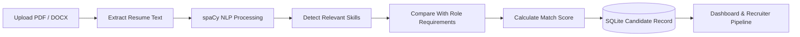

<div align="center">

# 🧠 AI Resume Screening & ATS Dashboard

### A visual, NLP-powered applicant tracking system for faster and more structured hiring decisions.

<p>
  <a href="https://github.com/sgsinghashka-del/AI_Resume_Screening_DS"></a>
  
  
  
  
  
</p>

<p>
  <a href="#-quick-start">Quick Start</a> ·
  <a href="#-product-tour">Product Tour</a> ·
  <a href="#-how-it-works">How It Works</a> ·
  <a href="#-roadmap">Roadmap</a>
</p>

<br />


</div>

---

## ✨ Project Snapshot

**AI Resume Screening & ATS Dashboard** is a Streamlit-based recruitment workspace that turns unstructured resumes into actionable candidate insights.

Recruiters can upload PDF or DOCX resumes, extract relevant skills with spaCy, compare candidates against role requirements, calculate a match score, and move applicants through a visual hiring pipeline—all backed by a lightweight SQLite database.

> **Built as a practical MVP:** simple to run locally, easy to understand, and ready to evolve into a production-grade recruitment platform.

## 🎯 What It Solves

Manual resume screening is repetitive, difficult to scale, and often inconsistent. This project demonstrates a structured workflow for:

- reducing the time spent reviewing resumes
- standardizing first-pass skill matching
- giving recruiters a single view of candidate progress
- making screening outcomes easier to inspect and compare
- creating a foundation for analytics and intelligent hiring tools

## 🚀 Core Capabilities

| Capability | Description |
| --- | --- |
| 🔐 Role-based access | Demo login flows for Admin, HR, Recruiter, and Client roles |
| 📄 Resume ingestion | Upload PDF and DOCX resumes directly from the app |
| 🧠 Skill extraction | Identify role-relevant skills with spaCy and rule-based matching |
| 📊 Match scoring | Compare detected skills with requirements for the selected role |
| 🗂️ Hiring pipeline | Move candidates through Applied, Shortlisted, Interview, and Offer stages |
| 📋 Recruiter board | Review stored candidates and their screening information |
| ⚖️ Compliance view | Surface a simple bias-risk review based on match scores |
| 💾 Persistent storage | Save candidate records in SQLite |
| 📤 Shortlist workflow | Support downloads for candidates marked for interview |

## 🖥️ Product Tour

### 1. Secure entry point

<p align="center">
  
</p>

A clean login experience provides separate demo access paths for the major recruitment stakeholders.

### 2. Decision-ready dashboard

<p align="center">
  
</p>

The dashboard provides a quick view of application volume, average matching performance, and interview activity.

### 3. Recruiter workspace

<p align="center">
  
</p>

The recruiter board brings candidate roles, scores, stages, and interview status into one reviewable workspace.

> The visuals above are repository-hosted SVG product mockups that document the intended experience. Run the application locally to interact with the live Streamlit interface.

## 🧩 How It Works



### Match-score formula

```text
Match Score = (Matched Required Skills / Total Required Skills) × 100
```

Supported role profiles currently include Backend Engineer, Frontend Engineer, DevOps Engineer, Data Scientist, HR Specialist, and Sales Executive.

## 🛠️ Technology Stack

| Layer | Tools |
| --- | --- |
| Interface | Streamlit |
| Application logic | Python |
| Natural language processing | spaCy (`en_core_web_sm`) |
| Resume parsing | PyPDF2, python-docx |
| Persistence | SQLite, pandas |
| Optional API utility | FastAPI (`backend.py`) |

## 📁 Repository Layout

```text
AI_Resume_Screening_DS/
├── app.py                       # Main Streamlit application
├── backend.py                   # FastAPI resume parsing utility
├── ats.db                      # SQLite database used by the app
├── requirements.txt            # Python dependencies
├── docs/
│   └── screenshots/            # README product visuals
│       ├── login-screen.svg
│       ├── dashboard.svg
│       └── recruiter-board.svg
└── README.md                   # Project documentation
```

## ⚡ Quick Start

### Prerequisites

- Python 3.10 or newer
- pip
- A virtual environment is recommended

### Installation

```bash
git clone https://github.com/sgsinghashka-del/AI_Resume_Screening_DS.git
cd AI_Resume_Screening_DS

python -m venv .venv

# macOS/Linux
source .venv/bin/activate

# Windows PowerShell
# .venv\Scripts\Activate.ps1

pip install -r requirements.txt
python -m spacy download en_core_web_sm
```

### Launch

```bash
streamlit run app.py
```

Then open [http://localhost:8501](http://localhost:8501).

## 🔑 Demo Access

> These credentials are for local demonstration only. Do not use them in a production deployment.

| Role | Email | Password |
| --- | --- | --- |
| Admin | `admin@company.com` | `admin123` |
| HR | `hr@company.com` | `hr123` |
| Recruiter | `recruiter@company.com` | `rec123` |
| Client | `demo@client.com` | `demo` |

## 🧪 Typical Workflow

1. Sign in with one of the demo accounts.
2. Open **Resume Processing**.
3. Enter the candidate name and select a target role.
4. Upload a PDF or DOCX resume.
5. Review extracted skills and the calculated match score.
6. Save the candidate to the database.
7. Track progress from the **Recruiter Board** or **Interview Pipeline**.
8. Review candidates in **Compliance Audit** and export interview shortlists.

## 🔒 Important Security Notes

This repository is a demonstration MVP. Before production use, consider:

- replacing hard-coded demo credentials with secure authentication
- using a password-hashing library such as Argon2 or bcrypt
- adding authorization checks for every role and action
- validating uploaded file size, type, and content
- storing resumes outside the repository and protecting personal data
- adding audit logs, encryption, retention policies, and consent controls
- testing skill extraction for fairness, accuracy, and bias

## 🗺️ Roadmap

- [ ] OAuth / SSO authentication
- [ ] Production-grade RBAC and secret management
- [ ] Candidate search, filtering, and pagination
- [ ] Rich analytics and hiring funnel visualizations
- [ ] LLM-assisted resume understanding with explainable results
- [ ] Interview scheduling and evaluation forms
- [ ] Automated tests and CI/CD
- [ ] Docker and cloud deployment for AWS, Azure, or GCP
- [ ] Multi-tenant organization support

## 🤝 Contributing

Ideas, improvements, and bug reports are welcome. A typical contribution flow is:

```bash
git checkout -b feature/your-improvement
# make your changes
git add .
git commit -m "Describe your improvement"
git push origin feature/your-improvement
```

Then open a pull request with a short explanation and screenshots for UI changes.

## 👩‍💻 Author

**Ashka Singh**

## 📄 License

This project is available under the [MIT License](LICENSE).

<div align="center">

### ⭐ If this project helped you, consider starring the repository.

<sub>AI-assisted recruitment workflows, designed for clarity and extensibility.</sub>

</div>
